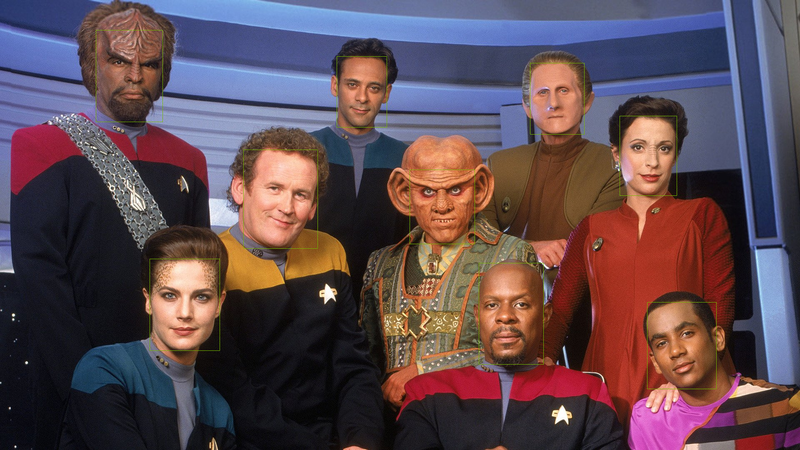

# FaceDetect

<p align="left">
    
</p>

<sub>Model performance on Klingons, Trills, Changelings or Bajorn has not been measured.</sub>


<p align="left">
    
</p>

This repo uses NVIDIA's enterprise containers available on NGC with a valid API_KEY. These containers provide best-in-class development tools and frameworks for the AI practitioner and reliable management and orchestration for the IT professional to ensure performance, high availability, and security. For more information on how to obtain access to these containers, check the [NVIDIA website](https://www.nvidia.com/en-us/data-center/products/ai-enterprise/).

## FaceDetect Model Card

### Model Overview

The model described in this card detects one or more faces in the given image / video. Compared to the FaceirNet model, this model gives better results on RGB images and smaller faces.

### Model Architecture

The model is based on NVIDIA DetectNet_v2 detector with ResNet18 as a feature extractor. This architecture, also known as GridBox object detection, uses bounding-box regression on a uniform grid on the input image. Gridbox system divides an input image into a grid which predicts four normalized bounding-box parameters (xc, yc, w, h) and confidence value per output class.

The raw normalized bounding-box and confidence detections needs to be post-processed by a clustering algorithm such as DBSCAN or NMS to produce final bounding-box coordinates and category labels.

### Training Algorithm

This model was trained using the DetectNet_v2 entrypoint in TAO. The training algorithm optimizes the network to minimize the localization and confidence loss for the objects. The training is carried out in two phases. In the first phase, the network is trained with regularization to facilitate pruning. Following the first phase, we prune the network removing channels whose kernel norms are below the pruning threshold. In the second phase the pruned network is retrained. Regularization is not included during the second phase.

#### TRAINING DATA

FaceNet v2.0 model was trained on a proprietary dataset with more than 1.8M faces. The training dataset consists of images taken from cameras mounted at varied heights and angles, cameras of varied field-of view (FOV) and occlusions.

##### Training Data Ground-truth Labeling Guidelines

The training dataset is created by labeling ground-truth bounding-boxes and categories by human labellers. Following guidelines were used while labelling the training data for NVIDIA FaceNet model.

FaceNet project labelling guidelines

- Face bounding boxes should be as tight as possible.
- Label each face bounding box with an occlusion level ranging from 0 to 9. 0 means the face is fully visible and 9 means the face is 90% or more occluded. For training, only faces with occlusion level 0-5 are considered.
- If faces are at the edge of the frame with visibility less than 60% due to truncation, this image is dropped from the dataset.

### Performance

#### EVALUATION DATA

##### Dataset

The inference performance of FaceNet v1.0 model was measured against 8018 proprietary images across a variety of environments, occlusion conditions, camera heights and camera angles.

##### Methodology and KPI

The true positives, false positives, false negatives are calculated using intersection-over-union (IOU) criterion greater than 0.5. The KPI for the evaluation data are reported in the table below. Model is evaluated based on mean Average Precision.

| Model          | FaceNet |
| -------------- | ------- |
| Content        | MAP     |
| Evaluation Set | 83.85%  |

#### REAL-TIME INFERENCE PERFORMANCE

The inference is run on the provided pruned model at INT8 precision. The inference performance is run using trtexec on Jetson Nano, AGX Xavier, Xavier NX and NVIDIA T4 GPU. The Jetson devices are running at Max-N configuration for maximum GPU frequency. The performance shown here is the inference only performance. The end-to-end performance with streaming video data might slightly vary depending on other bottlenecks in the hardware and software.

| Device | Precision | Batch_Size | FPS  |
| ------ | --------- | ---------- | ---- |
| Nano   | INT8      | 1          | 16   |
| NX     | INT8      | 1          | 329  |
| Xavier | INT8      | 1          | 537  |
| T4     | INT8      | 1          | 1703 |

### How to use this model

This model needs to be used with NVIDIA Hardware and Software. For Hardware, the model can run on any NVIDIA GPU including NVIDIA Jetson devices. This model can only be used with Train Adapt Optimize (TAO) Toolkit, DeepStream 6.0, Triton or TensorRT.

This model accepts 736x416x3 dimension input tensors and outputs 46x26x4 bbox coordinate tensor and 46x26x1 class confidence tensor. These output tensors then need to be post-processed with NMS or DBScan clustering algorithm to create appropriate bounding boxes.

There are two flavors of the model:

- unpruned
- pruned

The unpruned model is intended for training using TAO Toolkit and the user's own dataset. This can provide high fidelity models that are adapted to the use case. The Jupyter notebook available as a part of TAO container can be used to re-train. The pruned model is intended for efficient deployment on the edge using DeepStream or TensorRT. The unpruned and pruned models are encrypted and will only operate with the following key:

```sh
Model load key: nvidia_tlt
```

Please make sure to use this as the key for all TAO commands that require a model load key.

#### INPUT

Grayscale Image whose values in RGB channels are the same. 736 X 416 X 3 Channel Ordering of the Input: NCHW, where N = Batch Size, C = number of channels (3), H = Height of images (416), W = Width of the images (736) Input scale: 1/255.0 Mean subtraction: None

#### OUTPUT

Category labels (faces) and bounding-box coordinates for each detected face in the input image.

#### INSTRUCTIONS TO USE MODEL WITH TAO

In order, to use this model as a pretrained weights for transfer learning, please use the below mentioned snippet as template for the model_config component of the experiment spec file to train a DetectNet_v2 model. For more information on the experiment spec file, please refer to the TAO Toolkit User Guide.

```yaml
model_config {
  num_layers: 18
  pretrained_model_file: "/path/to/the/model.tlt"
  use_batch_norm: true
  load_graph: true
  objective_set {
    bbox {
      scale: 35.0
      offset: 0.5
    }
    cov {
    }
  }
  training_precision {
    backend_floatx: FLOAT32
  }
  arch: "resnet"
  all_projections: true
}
```

#### INSTRUCTIONS TO DEPLOY THIS MODEL WITH DEEPSTREAM

To create the entire end-to-end video analytic application, deploy this model with DeepStream.

### Limitations

**Very Small faces**

NVIDIA FaceNet model does not give good results on detecting small faces (generally, if the face occupies less than 10% of the image area, the face is small)

**Occluded Faces**

When faces are occluded or truncated such that less than 20% of the face is visible, they may not be detected by the FaceNet model.

**Warped and Blurry Images**

The FaceNet models were not trained on fish-eye lense cameras or moving cameras. Therefore, the models may not perform well for warped images and images that have motion-induced or other blur.

#### MODEL VERSIONS:

- **unpruned_v2.0** - Pre-trained model that is intended for training.
- **pruned_v2.0** - FP16 Deployment models that is intended to run on the inference pipeline.
- **pruned_quantized_v2.0** - INT8 Deployment models that is intended to run on the inference pipeline. Contains common INT8 calibration cache for GPU and DLA. The calibration file is generated for TensorRT 7.
- **pruned_quantized_v2.0.1** - INT8 Deployment models that is intended to run on the inference pipeline. Contains common INT8 calibration cache for GPU and DLA. The calibration file is generated for TensorRT 8.

### References

#### CITATIONS

- Redmon, J., Divvala, S., Girshick, R., Farhadi, A.: You only look once: Unified, real-time object detection. In: CVPR. (2016)
- Erhan, D., Szegedy, C., Toshev, A., Anguelov, D.: Scalable object detection using deep neural networks, In: CVPR. (2014)
- He, K., Zhang, X., Ren, S., Sun, J.: Deep Residual Learning for Image Recognition. In: CVPR (2015)

#### TECHNICAL BLOGS

Read the 2 part blog on training and optimizing 2D body pose estimation model with TAO - Part 1 | Part 2
Read the technical tutorial on how PeopleNet model can be trained with custom data using Transfer Learning Toolkit

#### SUGGESTED READING

More information on about TAO Toolkit and pre-trained models can be found at the NVIDIA Developer Zone
Read the TAO getting Started guide and release notes.
If you have any questions or feedback, please refer to the discussions on TAO Toolkit Developer Forums
Deploy your model on the edge using DeepStream. Learn more about DeepStream SDK

### License

License to use this model is covered by the Model EULA. By downloading the unpruned or pruned version of the model, you accept the terms and conditions of these licenses.

### Ethical Considerations

NVIDIA FaceNet model detects faces. However, no additional information such as race, gender, and skin type about the faces is inferred.

NVIDIA’s platforms and application frameworks enable developers to build a wide array of AI applications. Consider potential algorithmic bias when choosing or creating the models being deployed. Work with the model’s developer to ensure that it meets the requirements for the relevant industry and use case; that the necessary instruction and documentation are provided to understand error rates, confidence intervals, and results; and that the model is being used under the conditions and in the manner intended.

## Getting Started

### Requirements

- Docker
- Docker Compose
- NVIDIA GPUs on host
- NVIDIA AI Enterprise

### Install NGC CLI

NVIDIA NGC CLI is a command-line interface tool for managing Docker containers in the NVIDIA NGC Registry. With NGC CLI, you can perform the same operations that are available from the NGC website, such as running jobs, viewing ACE and node information, and viewing Docker repositories within your orgs. Read the docs [here](https://docs.ngc.nvidia.com/cli/index.html). You will need a valid API key to download containers, models and other content from the NVIDIA GPU Cloud (NGC).

### Download FaceNet

Pretrained model provided by NVIDIA

```sh
ngc registry model download-version \
  "nvidia/tao/facenet:deployable_v1.0" \
  --dest facenet_model
```

### Download TAO Converter

Converts the `model.etlt` to a `model.plan` file to use on Triton. This repo assumes xa6 but there are other versions available on [NGC](https://catalog.ngc.nvidia.com/orgs/nvidia/teams/tao/resources/tao-converter):

| TensorRT | Platform |
| -------- | -------- |
| 7.2      | x86      |
| 7.1      | x86      |
| 8.0      | x86      |
| 8.2      | x86      |
| 8.4      | x86      |
| 8.0      | aarch64  |
| 8.2      | aarch64  |
| 8.4      | aarch64  |

```sh
ngc registry resource download-version "nvidia/tao/tao-converter:v3.21.11_trt8.4_x86"
```

### Build Containers

```sh
docker compose build
```

### Run Model Conversion

```sh
docker compose up tlt-conversion
```

### Run Triton

```sh
docker compose up triton-server
```

### Run Jupyter Lab

```sh
docker compose up jupyter-demo
```
